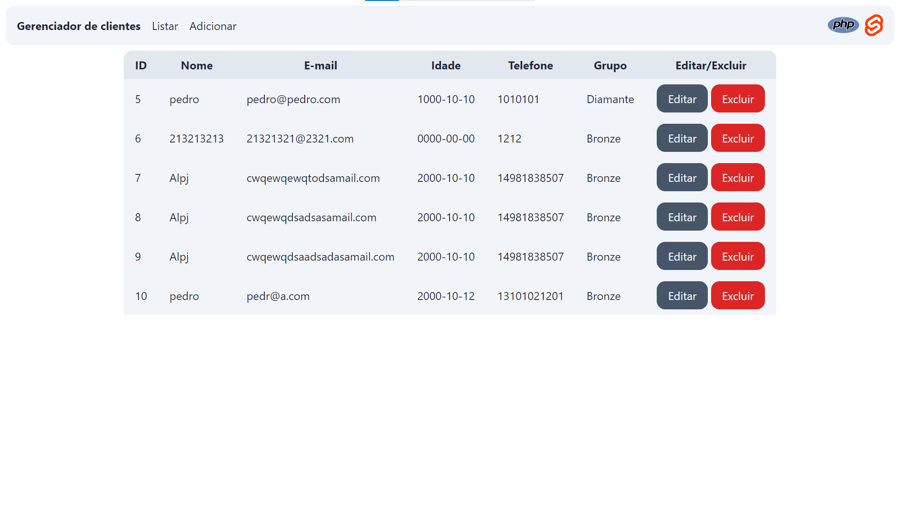
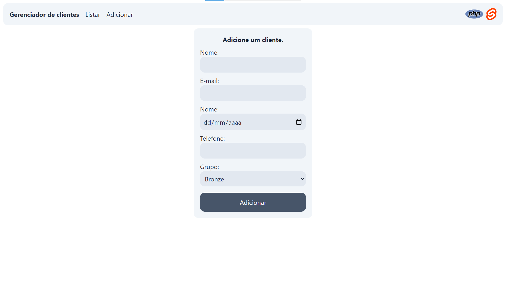

# Proponto: CRUD de clientes.

Projeto realizado no dia 21/10/2023.

# Sumário:

- [Tecnologias Usadas](#tecnologias-utilizadas);
- [Rodando o projeto](#tecnologias-utilizadas);
- [Imagens do site](#imagens-do-site);
- [Documentações](#documentação);

# Tecnologias utilizadas:

- Back-end (API): PHP.
- Front-end (Site): Svelte, TypeScript.

# Rodando o projeto:

Comecei a criar as imagens e containers para o projeto, entretanto, não finalizei a tempo. Apenas o website está rodando no Docker, o banco e a API não.

Antes de tudo, clone o repositório desse projeto:

    git clone https://github.com/PedroHAVeloso/proponto

Entre na pasta do projeto:

    cd proponto

### Rodando o projeto com PHP + Node.

> Aviso: você precisa ter o PHP 8 ou superior e o Node 18 ou superior na sua máquina.

Antes de tudo, lembre-se de criar o banco de dados necessário, seu script está em `./database.sql`. Caso precise mudar algum detalhe da conexão com ele em sua máquina, modifique o arquivo `./backend/src/Data/Database/Sql/SqlConnection.php`.

Dentro da pasta do projeto, crie dois terminais. No primeiro, entre dentro da pasta do backend:

    cd backend

E inicie a API em PHP:

    php -S localhost:1010 server.php

Após isso, no outro terminal, entre na pasta frontend:

    cd frontend

Instale as dependências do projeto:

    npm ci

Após, rode o site:

    npm run dev

Pronto! A API e o site estarão rodando na sua máquina.

### Rodando o projeto com Docker (apenas o site).

> Você deve ter o Docker e o Docker Compose (V2) instalados na sua máquina.

Após clonar o repositório e entrar dentro de sua pasta, você deve buildar as imagens do projeto:

    docker compose build

Após buildar, construa os containers:

    docker compose up -d

Pronto, o projeto (apenas o site até o momento) estará rodando na sua máquina.

# Imagens do site.




# Documentação.

## API.

A API está alocada na porta http://localhost:1010.
As suas funções são: adicionar, atualizar, excluir e listar clientes.

As respectivas rotas para cada função:

### Listar todos os clientes.

`GET /client`

**Resposta (tipos):**

```
{
    "id": int,
    "name": string,
    "email": string,
    "birth": string,
    "phone": string,
    "group": string
} []
```

**Resposta (exemplo):**
```json
[
    {
        "id": 1,
        "name": "Pedro",
        "email": "contatopedrohalves@gmail.com",
        "birth": "2005-07-15",
        "phone": "14981838507",
        "group": "Bronze"
    }
]
```

### Adicionar cliente.

`POST /client`

**Requisição (tipos):**
```
{
    "name": string,
    "email": string,
    "birth": string,
    "phone": string,
    "group": string
}
```

**Requisição (exemplo):**
```json
{
    "name": "Pedro",
    "email": "contatopedrohalves@gmail.com",
    "birth": "2005-07-15",
    "phone": "14981838507",
    "group": "Bronze"
}
```

### Atualizar cliente.

`PUT /client`

**Requisição (tipos):**
```
{
    "id": int,
    "name": string,
    "email": string,
    "birth": string,
    "phone": string,
    "group": string
}
```

**Requisição (exemplo):**
```json
{
    "id": 1,
    "name": "Pedro",
    "email": "contatopedrohalves@gmail.com",
    "birth": "2005-07-15",
    "phone": "14981838507",
    "group": "Bronze"
}
```

### Excluir cliente.

`DELETE /client`

**Requisição (tipos):**
```
{
    "id": int
}
```

**Requisição (exemplo):**
```json
{
    "id": "1"
}
```

---